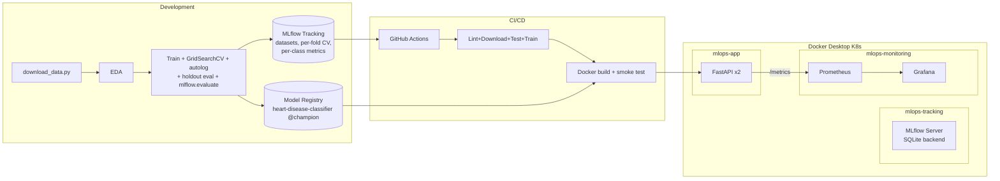

# Heart Disease Prediction — MLOps Pipeline

Binary classification on the Cleveland UCI Heart Disease dataset, wrapped in a full MLOps pipeline: data processing, training with MLflow tracking, a containerized FastAPI service, GitHub Actions CI/CD, and a Kubernetes deployment with Prometheus + Grafana monitoring.

For the full assignment write-up (EDA findings, model selection, results), see [`report.md`](./report.md).

## Architecture



The API exposes Prometheus metrics at `/metrics` via `prometheus-fastapi-instrumentator`. Prometheus scrapes the API across namespaces; Grafana's datasource and dashboard are auto-provisioned from ConfigMaps.

## Prerequisites

| Tool             | Version | Purpose                                              |
| ---------------- | ------- | ---------------------------------------------------- |
| Python           | 3.12+   | Runtime                                              |
| Docker Desktop   | latest  | Container runtime + local Kubernetes                 |
| kubectl          | bundled | Ships with Docker Desktop                            |
| Git              | any     | Clone the repo                                       |
| `act` (optional) | latest  | Run GitHub Actions locally — `brew install act`      |

**Docker Desktop:** enable Kubernetes (Settings → Kubernetes → Enable). Allocate at least **4 GB RAM and 2 CPUs** (Settings → Resources) — MLflow's pod requests up to 1.5 GiB.

**macOS:** disable AirPlay Receiver (System Settings → General → AirDrop & Handoff), or note that MLflow runs on **port 5001** to dodge the AirPlay conflict on 5000.

## Quick Start

```bash
git clone https://github.com/Santosh-src/MLOPS_Pipeline.git
cd MLOPS_Pipeline

python3 -m venv venv && source venv/bin/activate
pip install -r requirements.txt

python dataprocessing/download_data.py     # fetch UCI raw zip → data/ (idempotent, SHA-256 verified)
python dataprocessing/process_data.py      # clean dataset → processed_cleveland.csv (also auto-runs the download)
python -m src.training.train               # train, autolog grid candidates, register @champion in MLflow
pytest tests/ -v                           # 17 tests
```

### Run the API locally

```bash
uvicorn src.serving.app:app --port 8080
```

In another terminal:

```bash
curl http://localhost:8080/health

curl -X POST http://localhost:8080/predict \
  -H "Content-Type: application/json" \
  -d '{"age":63,"sex":1,"cp":3,"trestbps":145,"chol":233,"fbs":1,"restecg":0,"thalach":150,"exang":0,"oldpeak":2.3,"slope":0,"ca":0,"thal":6}'
```

## Deploy to Kubernetes

```bash
./scripts/deploy.sh
```

Builds the Docker image (if not already built), applies all manifests, waits for rollouts.

| Namespace          | Components             | URL                                                |
| ------------------ | ---------------------- | -------------------------------------------------- |
| `mlops-app`        | FastAPI (2 replicas)   | <http://localhost:8080>  — `/docs`, `/health`, `/metrics` |
| `mlops-tracking`   | MLflow tracking server | <http://localhost:5001>  *(5001 avoids macOS AirPlay)* |
| `mlops-monitoring` | Prometheus + Grafana   | <http://localhost:9090>, <http://localhost:3000> (admin/admin) |

Grafana is fully auto-provisioned (datasource + "Heart Disease API Monitoring" dashboard).

### Train against the in-cluster MLflow server

By default the trainer logs to a local `file://mlruns/` store. Once the K8s stack is up, point it at the SQLite-backed tracking server so runs (and the registered `heart-disease-classifier` model with the `@champion` alias) appear in the MLflow UI:

```bash
MLFLOW_TRACKING_URI=http://localhost:5001 MLOPS_ENV=dev \
  python -m src.training.train
```

#### What each run logs

- **Tags:** `git_commit`, `dataset_sha256`, `env`, `python_version`, `cv_folds`, `test_size`, `model_type`, `status` (set to `champion` on the winning run).
- **Datasets** (via `mlflow.data.from_pandas` + `log_input`): `cleveland-train` (context `training`) and `cleveland-test` (context `evaluation`) — schema and content hash captured automatically.
- **Params:** every grid candidate via `mlflow.sklearn.autolog()` (capped at 10 per grid), plus explicit `cv_folds`, `random_state`, `test_size`, `n_train`, `n_test`.
- **Metrics:** train_*, test_*, cv_* (mean + std), per-fold `fold_*` (step-indexed for line charts), per-class `per_class.{Disease,No_Disease,macro_avg,weighted_avg}.{precision,recall,f1-score,support}`, plus everything `mlflow.evaluate()` emits (`log_loss`, `precision_recall_auc`, `true/false_positives/negatives`, `score`, ...).
- **Artifacts:** model + signature + input example, `classification_report.json`, `predictions.json` (test-set predictions table), confusion matrix / ROC / PR / calibration / lift curves (from the default evaluator), our own `plots/{confusion_matrix,roc_curve}_test.png`, `metrics_summary.json`, `cv_results.csv`, `estimator.html`.
- **Registry:** the winning run's model is registered as `heart-disease-classifier` and tagged with the alias `@champion`. Subsequent winning runs replace the alias.

### Optional: Ingress

```bash
kubectl apply -f https://raw.githubusercontent.com/kubernetes/ingress-nginx/controller-v1.12.1/deploy/static/provider/cloud/deploy.yaml
echo "127.0.0.1 heart-disease.local" | sudo tee -a /etc/hosts
kubectl apply -f k8s/ingress.yaml
curl http://heart-disease.local/health
```

## CI/CD Pipeline

`.github/workflows/ci.yml` defines three jobs:

- **`ci`** — runs on every push, PR, or manual trigger: lint → download raw data (SHA-256 verified) → process data → data tests → train (autolog + register `@champion`) → model tests. Uploads test results, the trained model, and MLflow runs as artifacts.
- **`cd`** — runs after `ci` on push to `main`: builds the Docker image, runs a container smoke test (hits `/health` and `/predict`), then pushes to ghcr.io. If invoked locally via `act`, it also deploys to Docker Desktop K8s. When run as plain `act push` (no kubeconfig mounted), the deploy step soft-skips with a hint instead of failing — use `./scripts/act-local.sh push` to actually deploy.
- **`undeploy`** — manual only (`action=undeploy`). Tears down the stack via `act`; on the GitHub runner it just prints instructions, since it can't reach your local cluster.

### `workflow_dispatch` inputs

| Input              | Values                | Effect                                              |
| ------------------ | --------------------- | --------------------------------------------------- |
| `action`           | `deploy` / `undeploy` | Deploy stack (default) or tear it down              |
| `skip_cd`          | `false` / `true`      | Run only the `ci` job                               |
| `push_to_registry` | `false` / `true`      | Push image to ghcr.io (auto-true on push to `main`) |

### Run the workflow locally with `act`

```bash
brew install act

# CI only (no Kubernetes interaction) — plain act is fine
act -j ci

# Anything that touches K8s (full push, or undeploy) — use the wrapper,
# which mounts ~/.kube/config into the act container.
./scripts/act-local.sh push
./scripts/act-local.sh workflow_dispatch -j undeploy --input action=undeploy
```

The `cd` and `undeploy` jobs install Linux `kubectl` inside the container and call `scripts/act-kubeconfig.sh`, which patches the kubeconfig to reach Docker Desktop's K8s API through `host.docker.internal` with `--insecure-skip-tls-verify`. The result: `act` performs a real deploy/undeploy against your local cluster.

Why the wrapper? `act` doesn't expand environment variables in `.actrc`, so the kubeconfig mount path can't be portable there. The wrapper resolves `${HOME}` at run time and passes the mount via `--container-options`.

## Uninstall / Teardown

| Method                           | Command                                                              |
| -------------------------------- | -------------------------------------------------------------------- |
| Helper script                    | `./scripts/undeploy.sh`  /  `./scripts/undeploy.sh --all`            |
| Through the workflow (via `act`) | `./scripts/act-local.sh workflow_dispatch -j undeploy --input action=undeploy` |
| Raw kubectl                      | `kubectl delete namespace mlops-app mlops-tracking mlops-monitoring` |

`--all` also removes the local `heart-disease-api:latest` Docker image.


## API Reference

| Method | Path       | Description                                  |
| ------ | ---------- | -------------------------------------------- |
| GET    | `/`        | Liveness                                     |
| GET    | `/health`  | Readiness probe                              |
| POST   | `/predict` | Predict heart disease (JSON in/out)          |
| GET    | `/metrics` | Prometheus metrics                           |
| GET    | `/docs`    | Interactive Swagger UI                       |

Sample request body and response are in the [Quick Start](#run-the-api-locally) above.

## Project Layout

```
.
├── data/                            # UCI raw inputs (processed.cleveland.data, heart-disease.names)
├── dataprocessing/
│   └── process_data.py              # Clean raw UCI file → processed_cleveland.csv
├── src/
│   ├── data_prep/preprocess.py      # ColumnTransformer (scale + one-hot)
│   ├── evaluation/evaluate.py       # Metrics + diagnostic plots
│   ├── training/train.py            # GridSearchCV + autolog + holdout split + mlflow.evaluate + Registry @champion
│   └── serving/app.py               # FastAPI app (instrumented)
├── tests/
│   ├── test_data.py                 # 8 data tests
│   └── test_model.py                # 9 model tests
├── notebooks/                       # eda.ipynb, training.ipynb, inference.ipynb
├── k8s/
│   ├── namespaces.yaml              # mlops-app, mlops-tracking, mlops-monitoring
│   ├── deployment.yaml              # API deployment (2 replicas, probes, limits)
│   ├── service.yaml                 # API LoadBalancer
│   ├── ingress.yaml                 # NGINX ingress (optional)
│   ├── mlflow.yaml                  # ghcr.io/mlflow/mlflow:v3.11.1-full
│   ├── prometheus.yaml              # Prometheus + scrape ConfigMap
│   ├── grafana.yaml                 # Grafana + auto-provisioned datasource & dashboard
│   ├── deploy.sh                    # One-shot deploy
│   ├── undeploy.sh                  # One-shot teardown
│   └── act-kubeconfig.sh            # Kubeconfig patch for the act container
├── scripts/
│   ├── act-local.sh                 # act wrapper that mounts ~/.kube into the container
│   ├── download_data.py             # Fetch + SHA-256 verify UCI zip → data/ (auto-runs in every flow)
│   └── download_data.sh             # Same, in shell form (manual escape hatch)
├── .github/workflows/ci.yml         # CI/CD pipeline
├── .actrc                           # act configuration (image + --bind)
├── Dockerfile                       # Multi-stage, non-root
├── requirements.txt
├── ruff.toml
├── report.md                        # Assignment write-up
└── README.md
```

## Dataset

Cleveland Heart Disease Database — UCI ML Repository. Original investigators: Robert Detrano, M.D., Ph.D. 303 patients, 14 attributes (13 clinical features + binary target). The raw 14-attribute file (`processed.cleveland.data`) is fetched by `python dataprocessing/download_data.py` (idempotent, SHA-256 verified against UCI's public zip). Every entry point — `process_data.py`, `train.py`, `pytest`, the CI workflow — auto-invokes it first, so a fresh clone needs no manual data setup. `dataprocessing/process_data.py` then cleans it into `processed_cleveland.csv`. Sources: dataset page <https://archive.ics.uci.edu/ml/datasets/heart+Disease>, raw zip <https://archive.ics.uci.edu/static/public/45/heart+disease.zip>.


---

## Comprehensive Report

### Setup / Install Instructions

See [Prerequisites](#prerequisites) and [Quick Start](#quick-start) above. Summary:

1. Clone the repo and create a virtual environment.
2. `pip install -r requirements.txt` (all versions pinned).
3. `python dataprocessing/download_data.py` — fetches and SHA-256 verifies the UCI raw data.
4. `python dataprocessing/process_data.py` — cleans the dataset.
5. `python -m src.training.train` — trains models, logs to MLflow, registers `@champion`.
6. `pytest tests/ -v` — 17 tests.
7. `./scripts/deploy.sh` — deploys the full stack (API, MLflow, Prometheus, Grafana) to Docker Desktop Kubernetes.

### EDA and Modelling Choices

<!-- TODO: paste key EDA findings and model selection rationale here, or reference report.md -->

See [`report.md` §3–4](./report.md) for the full write-up. Key points:

- **Class balance:** 164 no-disease vs 139 disease (54% / 46%) — no resampling required.
- **Strongest features:** `thal`, `ca`, `oldpeak`, `exang`, `cp`.
- **Preprocessing:** `StandardScaler` on numerics, passthrough on binary, `OneHotEncoder` on categoricals — all inside an sklearn `Pipeline` for reproducibility.
- **Models compared:** Logistic Regression vs Random Forest, tuned via `GridSearchCV(scoring="roc_auc")`, 5-fold stratified CV.
- **Selection:** Logistic Regression (`C=1.0`) — highest CV ROC-AUC (0.9039), honest holdout test ROC-AUC **0.9675**, lower variance, faster inference, more interpretable.

### Experiment Tracking Summary

<!-- TODO: add MLflow UI screenshots here -->

- **Tool:** MLflow (tracking server deployed in K8s at `http://localhost:5001`, SQLite backend, proxy-served artifacts).
- **Per run logged:** params (all grid candidates via autolog), 85+ metrics (train/test/CV/per-fold/per-class + evaluator-generated), signatures, input examples, dataset lineage (`mlflow.data`), calibration/lift/PR/ROC plots, classification report, predictions table, `cv_results.csv`.
- **Model Registry:** `heart-disease-classifier` with moving `@champion` alias on the winning version.
- **Run tags:** `git_commit`, `dataset_sha256`, `env`, `python_version`, `cv_folds`, `test_size`, `model_type`, `status=champion`.

### Architecture Diagram

See [Architecture](#architecture) above (Mermaid diagram renders on GitHub). The system spans three namespaces:

- `mlops-app` — FastAPI (2 replicas) behind a LoadBalancer.
- `mlops-tracking` — MLflow server (SQLite + proxy artifact serving).
- `mlops-monitoring` — Prometheus + Grafana (auto-provisioned datasource and dashboard).

<!-- TODO: add exported diagram image to screenshots/ if needed for the .docx report -->

### CI/CD and Deployment Workflow Screenshots

<!-- TODO: add screenshots to screenshots/ and reference them below -->

| Screenshot | Description |
| --- | --- |
| `screenshots/ci-green.png` | GitHub Actions CI job passing (lint → download → test → train → model tests) |
| `screenshots/cd-smoke-test.png` | CD job: Docker build + container smoke test (`/health`, `/predict`) |
| `screenshots/k8s-pods.png` | `kubectl get pods -A` showing all pods running |
| `screenshots/swagger-ui.png` | FastAPI Swagger UI at `/docs` |
| `screenshots/predict-curl.png` | Successful `/predict` curl response |
| `screenshots/mlflow-runs.png` | MLflow UI — experiment runs with parent/child structure |
| `screenshots/mlflow-registry.png` | MLflow Model Registry — `heart-disease-classifier @champion` |
| `screenshots/grafana-dashboard.png` | Grafana "Heart Disease API Monitoring" dashboard |
| `screenshots/prometheus-targets.png` | Prometheus targets showing the API scrape endpoint healthy |

### Link to Code Repository

**GitHub:** <https://github.com/Santosh-src/MLOPS_Pipeline>
