# MLOps Assignment — Heart Disease Prediction Pipeline

**Student:** **Appana Santosh**

ID: **2025CS05017**

**Git Repo :** [https://github.com/Santosh-src/MLOPS_Pipeline](https://github.com/Santosh-src/MLOPS_Pipeline)

Demo Video : [https://wilpbitspilaniacin0-my.sharepoint.com/:v:/g/personal/2025cs05017_wilp_bits-pilani_ac_in/IQBINnpv1h_lTKW0V1n8sHPRAc9L-uOy7cEIJo7w5ReAMOo?nav=eyJyZWZlcnJhbEluZm8iOnsicmVmZXJyYWxBcHAiOiJPbmVEcml2ZUZvckJ1c2luZXNzIiwicmVmZXJyYWxBcHBQbGF0Zm9ybSI6IldlYiIsInJlZmVycmFsTW9kZSI6InZpZXciLCJyZWZlcnJhbFZpZXciOiJNeUZpbGVzTGlua0NvcHkifX0&e=wEQ0yk](https://wilpbitspilaniacin0-my.sharepoint.com/:v:/g/personal/2025cs05017_wilp_bits-pilani_ac_in/IQBINnpv1h_lTKW0V1n8sHPRAc9L-uOy7cEIJo7w5ReAMOo?nav=eyJyZWZlcnJhbEluZm8iOnsicmVmZXJyYWxBcHAiOiJPbmVEcml2ZUZvckJ1c2luZXNzIiwicmVmZXJyYWxBcHBQbGF0Zm9ybSI6IldlYiIsInJlZmVycmFsTW9kZSI6InZpZXciLCJyZWZlcnJhbFZpZXciOiJNeUZpbGVzTGlua0NvcHkifX0&e=wEQ0yk)

Document - [https://wilpbitspilaniacin0-my.sharepoint.com/:w:/g/personal/2025cs05017_wilp_bits-pilani_ac_in/IQA1V646MyEwRrhZ7u-wwxc-AQQdFtLHG8KtFddnwgDv8Ms?e=lLg8T6](https://wilpbitspilaniacin0-my.sharepoint.com/:w:/g/personal/2025cs05017_wilp_bits-pilani_ac_in/IQA1V646MyEwRrhZ7u-wwxc-AQQdFtLHG8KtFddnwgDv8Ms?e=lLg8T6)

## Table of Contents

- [1. Overview](#1-overview)
- [2. Prerequisites & Local Setup](#2-prerequisites--local-setup)
  - [Prerequisites](#prerequisites)
  - [Reproducible setup (Local Setup)](#reproducible-setup-local-setup)
  - [Run the API locally](#run-the-api-locally)
  - [Deploy the full stack to local Kubernetes](#deploy-the-full-stack-to-local-kubernetes)
- [3. Data Acquisition & EDA](#3-data-acquisition--eda)
  - [Dataset](#dataset)
  - [Cleaning (dataprocessing/process_data.py)](#cleaning-dataprocessingprocess_datapy)
  - [EDA (notebooks/eda.ipynb)](#eda-notebooksedaipynb)
  - [EDA Visualisations](#eda-visualisations)
- [4. Feature Engineering & Model Development](#4-feature-engineering--model-development)
  - [Preprocessing pipeline (src/data_prep/preprocess.py)](#preprocessing-pipeline-srcdata_preppreprocesspy)
  - [Models (src/training/train.py)](#models-srctrainingtrainpy)
  - [Cross-validation results](#cross-validation-results)
  - [Model selection rationale](#model-selection-rationale)
- [5. Experiment Tracking](#5-experiment-tracking)
  - [Experiment tracking summary](#experiment-tracking-summary)
- [6. Model Packaging & Reproducibility](#6-model-packaging--reproducibility)
- [7. CI/CD Pipeline & Automated Testing](#7-cicd-pipeline--automated-testing)
  - [Tests (17 total)](#tests-17-total)
  - [GitHub Actions (.github/workflows/ci.yml)](#github-actions-githubworkflowsciyml)
  - [Manual triggers](#manual-triggers)
  - [Local execution with act](#local-execution-with-act)
  - [CI/CD workflow screenshots](#cicd-workflow-screenshots)
- [8. Containerization](#8-containerization)
- [9. Production Deployment](#9-production-deployment)
  - [Deployment verification](#deployment-verification)
- [10. Monitoring & Logging](#10-monitoring--logging)
  - [Structured request logs](#structured-request-logs)
  - [Prometheus (pull model)](#prometheus-pull-model)
  - [Grafana (auto-provisioned)](#grafana-auto-provisioned)
- [11. Conclusion](#11-conclusion)

## 1. Overview

A binary classifier for heart disease, built on the Cleveland UCI dataset, wrapped in a full MLOps pipeline: data processing → training with MLflow tracking → tested FastAPI service → containerized → CI/CD via GitHub Actions → deployed to Docker Desktop Kubernetes with Prometheus + Grafana monitoring.

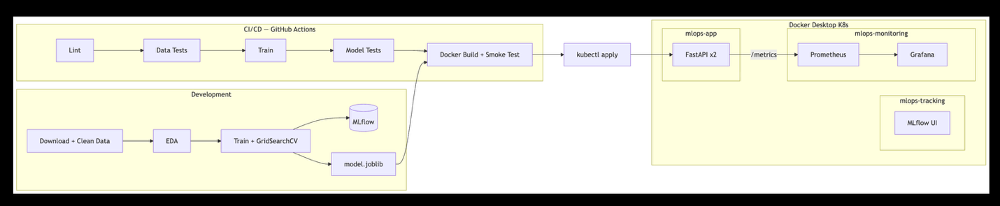

## 2. Prerequisites & Local Setup

### Prerequisites

| Tool | Version | Purpose |
| --- | --- | --- |
| Python | 3.12+ | Runtime |
| Docker Desktop | latest | Container runtime + local Kubernetes cluster |
| kubectl | bundled | Ships with Docker Desktop |
| Git | any | Clone the repo |
| `act` *(optional)* | latest | Run the GitHub Actions workflow locally (`brew install act`) |

**Docker Desktop settings:** enable Kubernetes (Settings → Kubernetes → Enable). Allocate at least 4 GB RAM and 2 CPUs (Settings → Resources). MLflow's pod requests up to 1.5 GiB.

**macOS users:** disable AirPlay Receiver (System Settings → General → AirDrop & Handoff) or accept that MLflow runs on **port 5001** to avoid a conflict on port 5000.

### Reproducible setup (Local Setup)

```bash
git clone https://github.com/Santosh-src/MLOPS_Pipeline.git
cd MLOPS_Pipeline

python3 -m venv venv && source venv/bin/activate
pip install -r requirements.txt

python dataprocessing/process_data.py      # cleans the Cleveland raw file
python -m src.training.train               # trains, logs to MLflow, saves model
pytest tests/ -v                           # 17 tests
```

### Run the API locally

```bash
uvicorn src.serving.app:app --port 8080
curl http://localhost:8080/health
```

### Deploy the full stack to local Kubernetes

```bash
./scripts/deploy.sh        # builds image, applies manifests, waits for rollouts
./scripts/undeploy.sh      # tears it all down
```

## 3. Data Acquisition & EDA

### Dataset

Cleveland Heart Disease Database, UCI ML Repository. Original investigators: Robert Detrano, M.D., Ph.D. The full database has 76 attributes; published research uses the standard 14-attribute extraction, which is what we use.

| Feature | Description | Type |
| --- | --- | --- |
| age | Age in years | Numeric |
| sex | 1 = male, 0 = female | Binary |
| cp | Chest pain type (1–4) | Categorical |
| trestbps | Resting blood pressure (mm Hg) | Numeric |
| chol | Serum cholesterol (mg/dl) | Numeric |
| fbs | Fasting blood sugar > 120 mg/dl | Binary |
| restecg | Resting ECG (0–2) | Categorical |
| thalach | Maximum heart rate achieved | Numeric |
| exang | Exercise-induced angina | Binary |
| oldpeak | ST depression induced by exercise | Numeric |
| slope | Slope of peak exercise ST segment | Categorical |
| ca | Major vessels coloured by fluoroscopy | Categorical |
| thal | Thalassemia (3=normal, 6=fixed, 7=rev) | Categorical |
| target | 0 = no disease, 1 = disease (binarised) | Binary |

### Cleaning (`dataprocessing/process_data.py`)

The raw UCI file (`data/processed.cleveland.data`) ships with the repository.

1. Loads with `?` mapped to `NaN`.
2. Imputes numeric columns with median, categorical/binary with mode (6 missing values: 4 in `ca`, 2 in `thal`).
3. Binarises target (0 vs 1–4) and casts integer columns.
4. Writes `dataprocessing/processed_cleveland.csv` (303 rows, 14 cols, 0 missing).

### EDA (`notebooks/eda.ipynb`)

- **Class balance:** 164 no-disease vs 139 disease (54.1% / 45.9%) — workable without resampling.
- **Strongest correlates with target:** `thal`, `ca`, `oldpeak`, `exang`, `cp`.
- Disease patients show **lower** max heart rate (`thalach`) and are slightly older.
- Asymptomatic chest pain (`cp = 4`) is strongly associated with disease.

### EDA Visualisations

Key plots produced in the notebook (also saved to `screenshots/`):

**Class distribution bar chart** — 164 no-disease vs 139 disease (54.1%/45.9%), confirming no severe imbalance.

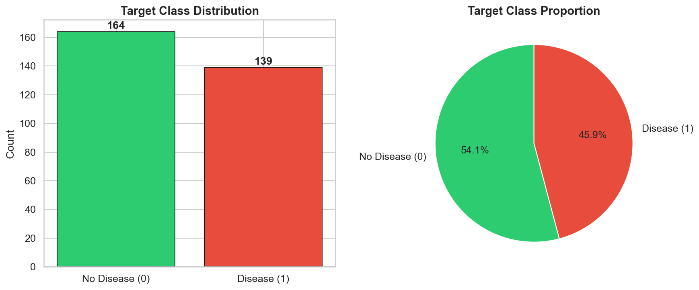

**Correlation heatmap** — highlights `cp`, `thalach`, `exang`, `oldpeak`, `ca`, and `thal` as the strongest correlates with the target.

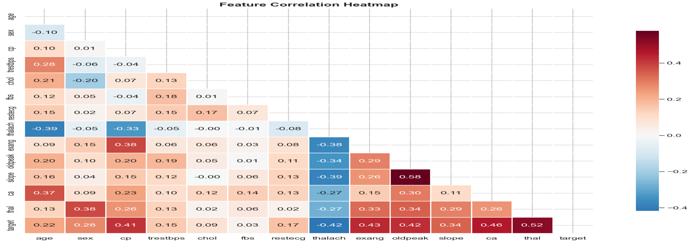

**Histograms per feature** — numeric feature distributions faceted by disease status; disease patients skew older with lower max heart rates.

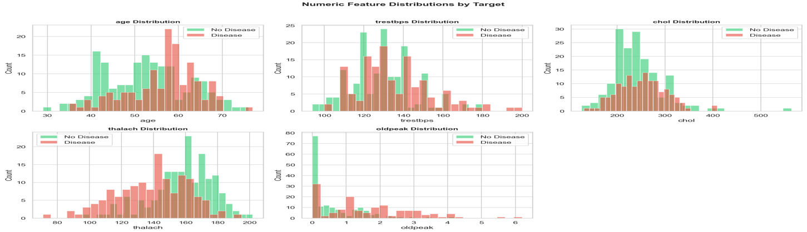

**Box plots** — `oldpeak` and `thalach` show clear separation between classes.

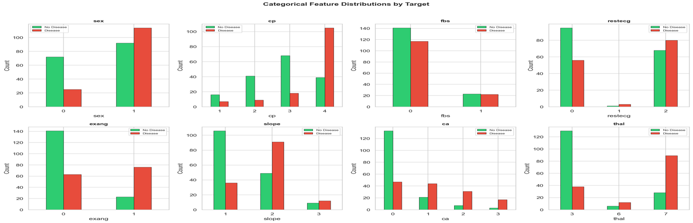

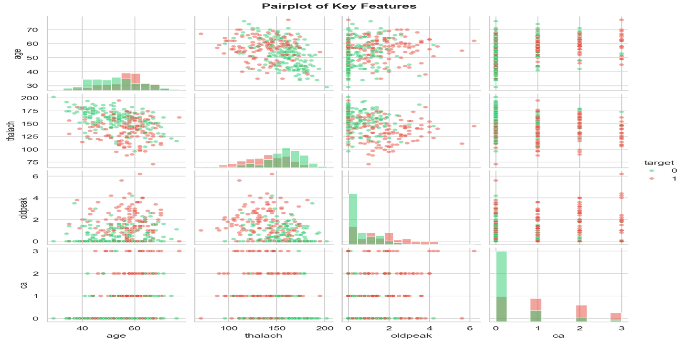

## 4. Feature Engineering & Model Development

### Preprocessing pipeline (`src/data_prep/preprocess.py`)

A `ColumnTransformer` packed inside an sklearn `Pipeline`:

- Numeric (`age`, `trestbps`, `chol`, `thalach`, `oldpeak`) → `StandardScaler`
- Binary (`sex`, `fbs`, `exang`) → passthrough
- Categorical (`cp`, `restecg`, `slope`, `ca`, `thal`) → `OneHotEncoder(handle_unknown="ignore")`

The same pipeline is used at training and inference, so the served model accepts raw feature values.

### Models (`src/training/train.py`)

| Model | Hyperparameter grid |
| --- | --- |
| Logistic Regression | `C ∈ {0.01, 0.1, 1.0, 10.0}` |
| Random Forest | `n_estimators ∈ {50, 100, 200}`, `max_depth ∈ {5, 10, None}`, `min_samples_split ∈ {2, 5}` |

Both are tuned with `GridSearchCV(scoring="roc_auc")` over a 5-fold `StratifiedKFold`, then re-evaluated with `cross_validate` across the full metric set.

### Cross-validation results

| Metric | Logistic Regression | Random Forest |
| --- | ---: | ---: |
| Accuracy | 0.8580 | 0.8415 |
| Precision | 0.8874 | 0.8716 |
| Recall | 0.7905 | 0.7690 |
| F1 | 0.8343 | 0.8155 |
| ROC-AUC | **0.9192** | 0.9186 |

**Selected: Logistic Regression** (`C = 1.0`). Marginally higher CV ROC-AUC, smaller train/CV gap, faster inference, and easier to explain to a clinician than a forest.

### Model selection rationale

Both models achieve strong CV ROC-AUC (>0.91). Logistic Regression was chosen because:

1. **Comparable performance** — only 0.0006 ROC-AUC difference; not statistically significant.
2. **Lower variance** — smaller gap between train and CV metrics, suggesting better generalisation.
3. **Interpretability** — coefficients directly map to feature importance, critical in a clinical setting.
4. **Inference speed** — single matrix multiply vs ensemble of trees; important for low-latency serving.

## 5. Experiment Tracking

MLflow is wired into `train.py`. Each model gets its own run logging:

- **Params** — model type, best hyperparameters, CV folds
- **Metrics** — accuracy, precision, recall, F1, ROC-AUC for both train set and CV (mean + std)
- **Artifacts** — confusion matrix PNG, ROC curve PNG, the serialized sklearn model

**View experiments locally:**

```bash
mlflow ui --port 5001
```

**View on Kubernetes** (after `./scripts/deploy.sh`):

Open <http://localhost:5001> — the `mlops-tracking` namespace runs `ghcr.io/mlflow/mlflow:v3.11.1-full` on port 5000 internally, exposed as 5001 to avoid the macOS AirPlay conflict.

### Experiment tracking summary

| Run | Model | Best Params | CV ROC-AUC | CV Accuracy | CV F1 |
| --- | --- | --- | ---: | ---: | ---: |
| 1 | Logistic Regression | C=1.0 | 0.9192 | 0.8580 | 0.8343 |
| 2 | Random Forest | n_estimators=100, max_depth=None, min_samples_split=2 | 0.9186 | 0.8415 | 0.8155 |

**Artifacts logged per run:** confusion matrix (PNG), ROC curve (PNG), serialized sklearn pipeline (joblib), and metrics JSON.

**Screenshots:**

Experiments:

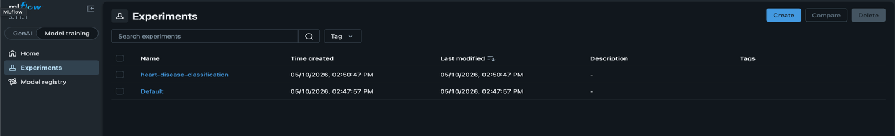

Runs:

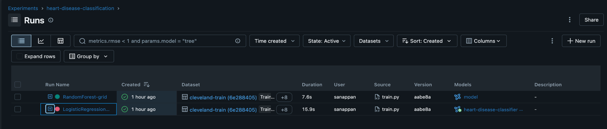

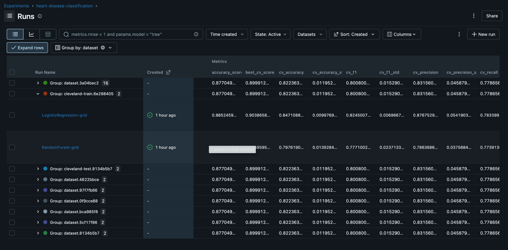

Registry:

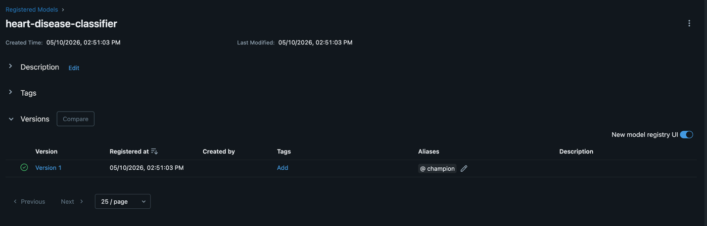

## 6. Model Packaging & Reproducibility

- **Artifact:** `model/heart_disease_model.joblib` — the entire `Pipeline` (preprocessor + classifier), so inference doesn't need a separate transform step.
- **Metrics summary:** `model/metrics.json` — best model, best params, CV and train metrics.
- **Pinned dependencies:** `requirements.txt`.
- **Determinism:** `random_state = 42` everywhere; cleaning is deterministic given the source file.

```bash
python3 -m venv venv && source venv/bin/activate
pip install -r requirements.txt
python dataprocessing/process_data.py
python -m src.training.train
```

## 7. CI/CD Pipeline & Automated Testing

### Tests (17 total)

- `tests/test_data.py` — 8 tests on the processed dataset: existence, shape, no nulls, columns, target binary, feature ranges, dtypes, class balance.
- `tests/test_model.py` — 9 tests on the trained model: file exists, loads, has `predict`/`predict_proba`, prediction shape and binary output, probabilities sum to 1, accuracy ≥ 0.75, batch prediction.

### GitHub Actions (`.github/workflows/ci.yml`)

Three jobs, with sane gating:

`ci` — runs on every push, PR, or `workflow_dispatch`:

1. Lint (`ruff`)
2. Process data (download + clean)
3. Data tests (8)
4. Train models (GridSearchCV + MLflow)
5. Model tests (9)
6. Upload artifacts: test results (JUnit XML), trained model, MLflow runs

The data tests must pass *before* training, and the model tests must pass *after* — which catches silent breakage in either layer.

`cd` — runs after `ci` on push to `main` (skippable via `skip_cd` input):

1. Pull the trained model artifact
2. Build the Docker image
3. **Container smoke test** — runs the image, hits `/health` and `/predict`. Failing here blocks the push.
4. Tag and push to `ghcr.io` (gated by `push_to_registry` input)
5. If invoked locally via `act`, deploy to Docker Desktop K8s

`undeploy` — only runs when `action=undeploy` is selected. Tears the stack down via `act` (no-op on the GitHub runner, since it can't reach your local cluster).

### Manual triggers

| Input | Values | Effect |
| --- | --- | --- |
| `action` | `deploy` / `undeploy` | Deploy stack (default) or tear it down |
| `skip_cd` | `false` / `true` | Run only the `ci` job |
| `push_to_registry` | `false` / `true` | Push image to ghcr.io (auto-true on push to `main`) |

### Local execution with `act`

```bash
brew install act

# CI only — no Kubernetes interaction
act -j ci

# Anything that touches K8s — wrapper mounts ~/.kube into the act container
./scripts/act-local.sh push
./scripts/act-local.sh workflow_dispatch -j undeploy --input action=undeploy
```

The `cd` and `undeploy` jobs install Linux `kubectl` inside the container and call `k8s/act-kubeconfig.sh`, which patches the kubeconfig to reach Docker Desktop's K8s API through `host.docker.internal` with `--insecure-skip-tls-verify`. The wrapper exists because `act` does not expand environment variables in `.actrc`, so the kube mount path can't be made portable there.

### CI/CD workflow screenshots

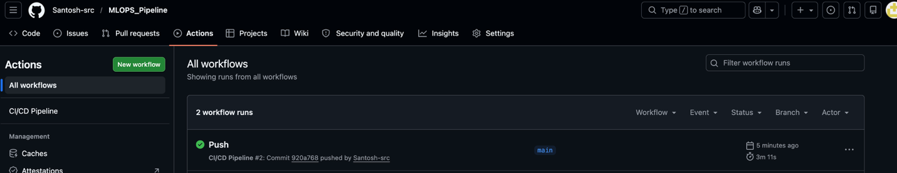

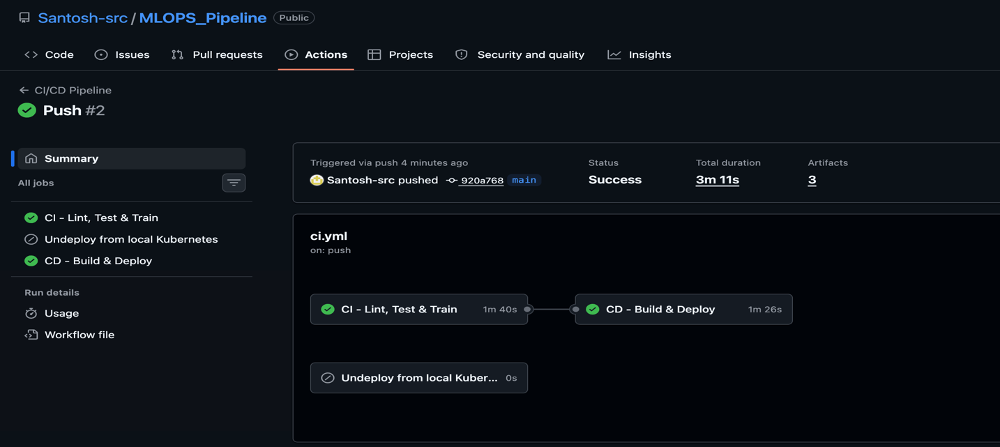

## 8. Containerization

`src/serving/app.py` (FastAPI) exposes:

| Method | Path | Purpose |
| --- | --- | --- |
| GET | `/` | Liveness |
| GET | `/health` | Readiness probe |
| POST | `/predict` | Prediction (JSON in/out, Pydantic-validated) |
| GET | `/metrics` | Prometheus metrics |
| GET | `/docs` | Swagger UI |

`Dockerfile` is a two-stage build on `python:3.12-slim`: dependencies in stage 1, runtime image in stage 2 with non-root `appuser`, `HEALTHCHECK`, and port 8080 exposed.

```bash
docker build -t heart-disease-api .
docker run -p 8080:8080 heart-disease-api
curl -X POST http://localhost:8080/predict \
  -H "Content-Type: application/json" \
  -d '{"age":63,"sex":1,"cp":3,"trestbps":145,"chol":233,"fbs":1,"restecg":0,"thalach":150,"exang":0,"oldpeak":2.3,"slope":0,"ca":0,"thal":6}'
```

**Sample prediction response:**

```json
{
  "prediction": 1,
  "confidence": 0.8421,
  "disease_probability": 0.8421
}
```

The `/predict` endpoint accepts JSON input matching the 13 features, validates via Pydantic, and returns the prediction (0/1), confidence, and disease probability.

**Screenshots:**

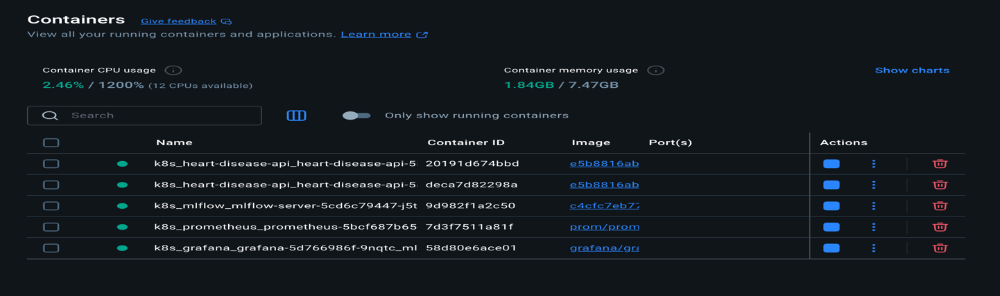

Namespace:

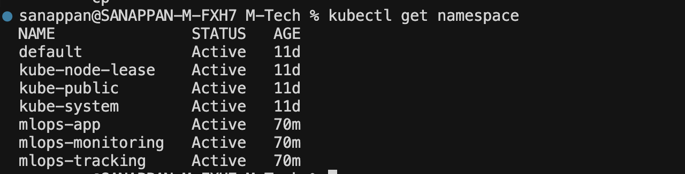

Pods:

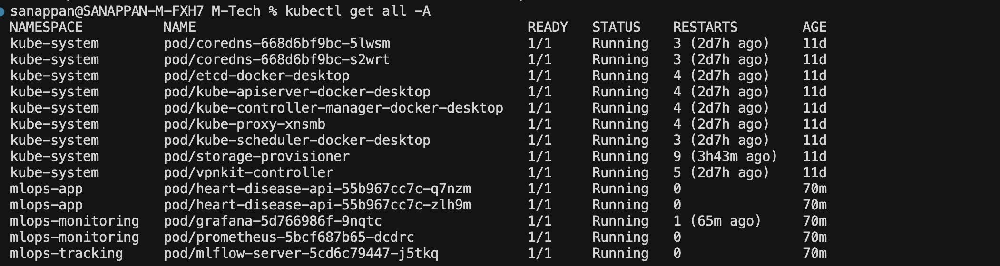

Service:

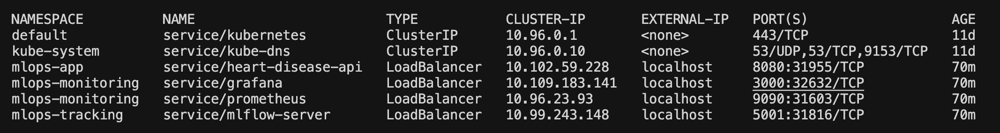

Deployment & Replicas:

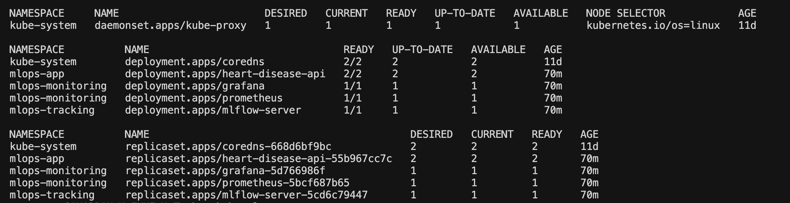

## 9. Production Deployment

Deployed to Docker Desktop's built-in Kubernetes across three namespaces.

| Namespace | Components | Notes |
| --- | --- | --- |
| `mlops-app` | `Deployment` (2 replicas) + `Service` + `Ingress` | Probes, resource limits, `imagePullPolicy: Never` |
| `mlops-tracking` | MLflow `Deployment` + `Service` | Official `ghcr.io/mlflow/mlflow:v3.11.1-full` image, SQLite backend, single worker, 1.5 GiB limit |
| `mlops-monitoring` | Prometheus + Grafana `Deployment`s + `Service`s | Cross-namespace scraping; Grafana auto-provisioned via ConfigMaps |

**Manifests** (`k8s/`): `namespaces.yaml`, `deployment.yaml`, `service.yaml`, `ingress.yaml`, `mlflow.yaml`, `prometheus.yaml`, `grafana.yaml`.

**One-shot deploy:**

```bash
./scripts/deploy.sh
```

| Endpoint | URL |
| --- | --- |
| API | <http://localhost:8080> |
| API (Ingress, optional) | <http://heart-disease.local> |
| MLflow UI | <http://localhost:5001> |
| Prometheus | <http://localhost:9090> |
| Grafana | <http://localhost:3000> (admin / admin) |

**Tear down:**

```bash
./scripts/undeploy.sh             # delete the three namespaces
./scripts/undeploy.sh --all       # also remove the local heart-disease-api Docker image
```

### Deployment verification

After `./scripts/deploy.sh` completes, all pods are running:

```
NAMESPACE          NAME                                  READY   STATUS    RESTARTS
mlops-app          heart-disease-api-xxx-yyy             1/1     Running   0
mlops-app          heart-disease-api-xxx-zzz             1/1     Running   0
mlops-tracking     mlflow-xxx-yyy                        1/1     Running   0
mlops-monitoring   prometheus-xxx-yyy                    1/1     Running   0
mlops-monitoring   grafana-xxx-yyy                       1/1     Running   0
```

Endpoints are verified with curl:

```bash
curl http://localhost:8080/health          # {"status":"healthy","model_loaded":true}
curl http://localhost:5001                 # MLflow UI accessible
curl http://localhost:9090/targets         # Prometheus shows heart-disease-api target UP
curl http://localhost:3000                 # Grafana dashboard loads
```

**Screenshots:**

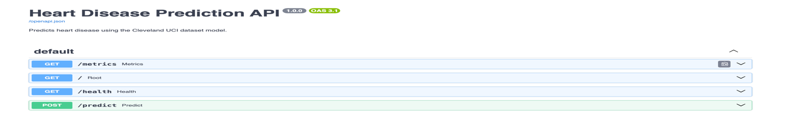

/metrics


/health

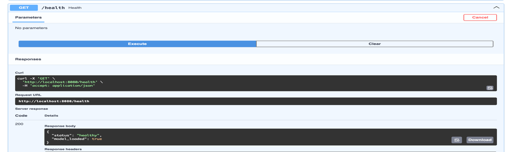

Predict 1:

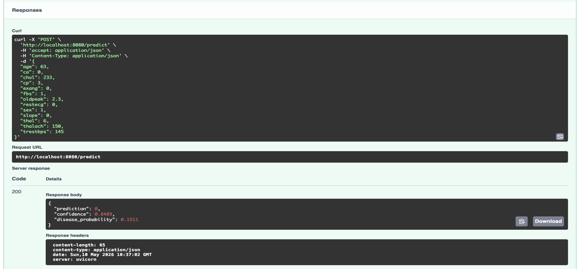

Predict 2:

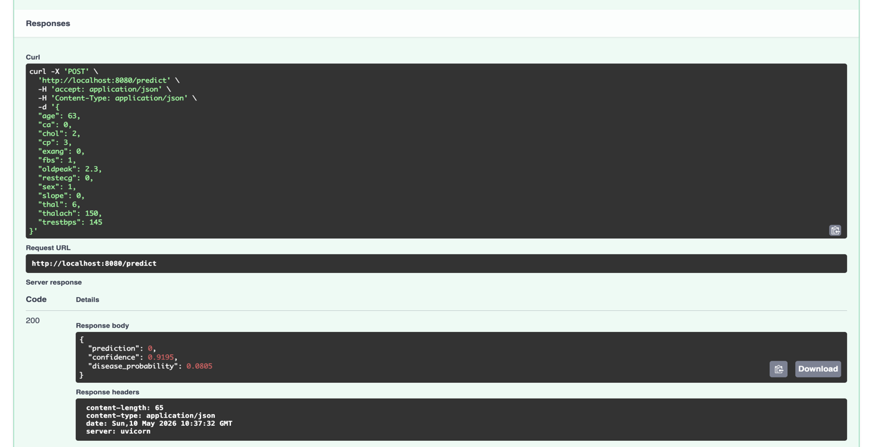

## 10. Monitoring & Logging

### Structured request logs

Every prediction emits a single JSON line on stdout:

```json
{"event":"prediction","input":{...},"prediction":1,"disease_probability":0.84,"confidence":0.84,"latency_ms":3.21}
```

Picked up by `kubectl logs` and any log shipper.

### Prometheus (pull model)

`prometheus-fastapi-instrumentator` adds `/metrics` to the FastAPI app. Prometheus scrapes it every 15 seconds at:

```
heart-disease-api.mlops-app.svc.cluster.local:8080/metrics
```

Standard metrics exposed: `http_requests_total`, `http_request_duration_seconds`, `http_requests_in_progress`.

### Grafana (auto-provisioned)

Defined in `k8s/grafana.yaml` via three ConfigMaps:

- **Datasource** — Prometheus at the in-cluster service URL, marked default.
- **Dashboard provider** — file provisioner pointing at `/var/lib/grafana/dashboards`.
- **Dashboard** — "Heart Disease API Monitoring" with six panels: request rate, latency p50/p95/p99, requests by status, error rate, health status, in-flight requests.

After `./scripts/deploy.sh`, open <http://localhost:3000> (admin/admin) — the dashboard is already there.

**Screenshots:**

Prometheus:

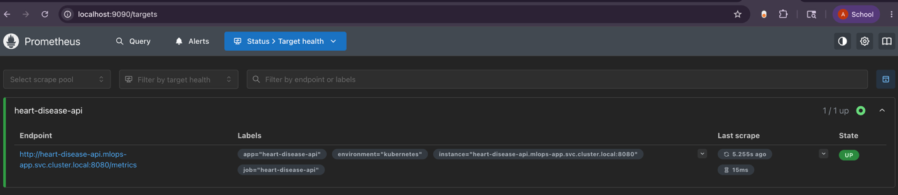

Grafana:

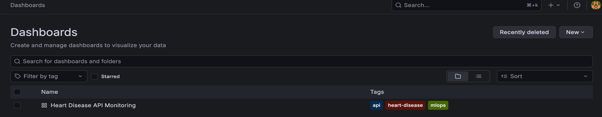

Metrics:

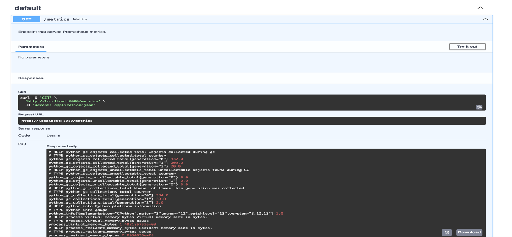

## 11. Conclusion

The pipeline covers the full lifecycle end to end:

- Deterministic data processing with download + cleaning
- Two models compared with cross-validation; Logistic Regression selected
- MLflow tracking of params, metrics, and plots for every run
- 17 unit tests gating CI; container smoke test gating CD
- Multi-stage Docker image, non-root, healthchecked
- Kubernetes deployment across three namespaces with auto-provisioned monitoring
- The whole CI/CD workflow is runnable locally with `act` (including real K8s deploy and undeploy)
